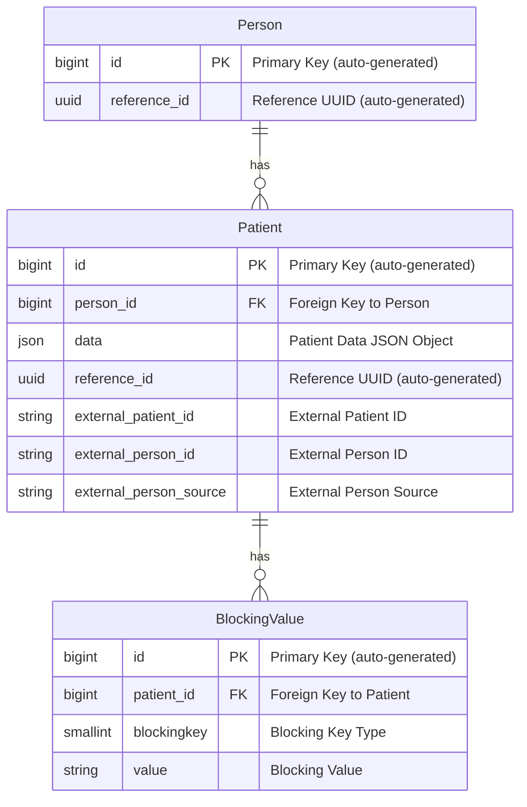

# Design

This document provides an overview of the key database models involved in the Master Patient Index (MPI) system and explains how they interact to facilitate person linking via an algorithm.

## Key Models

### 1. **Person Model**

The `Person` model represents an individual in the MPI system. Each person may have multiple associated `Patient` records, which are unique representations of that person in various external systems.

### 2. **Patient Model**

The `Patient` model represents an external record for a person.  This is a point-in-time representation of an individual sourced in a health care document. Each `Patient` is linked to a single `Person` and contain multiple `BlockingValue` records that aid in matching similar patients.

### 3. **BlockingValue Model**

The `BlockingValue` model stores all the potential key-value pairs used in the record linkage process. These pairs represent simplified or truncated versions of personally identifiable information (PII), such as birthdate, name, or address, which are used in the blocking phase of the algorithm to quickly find potential matches.

---

## Entity Relationship Diagram

The following diagram illustrates the relationships between the `Person`, `Patient`, and `BlockingValue` models:

---

## How These Models Work in the Algorithm

The MPI system is designed to link records from different sources that potentially represent the same person. The record linkage algorithm uses **blocking keys** to reduce the number of potential matches to be evaluated. The workflow can be described as follows:

1. **Data Ingestion**:
   When patient data is loaded into the system, the **Patient** record is initialized, and the **BlockingValue** records are generated based on the patient's PII data (e.g., birthdate, name, address).
   
1. **Blocking**:
   The **BlockingKey** enum defines the types of blocking values that are generated from the patient data. For example, the first 4 characters of the patient's first name or their birthdate can serve as a blocking key.
   
   Blocking is used to reduce the search space for potential matches by grouping patients based on these simplified values. Only records that share the same blocking values are compared in detail, making the matching process more efficient.

   We use the **BlockingValue** records from the incoming patient to quickly find potential matches against existing patients in the MPI (matching on their blocking values).

1. **Record Linkage**:
   The system compares patient records that share the same blocking values. It uses other details stored in the **Patient** model, such as name, address, MRN, etc, to calculate a **belongingness ratio**, indicating the percentage of patients within a person cluster that the new patient record matches with.

1. **Person Linking**:
   If the belongingness ratio exceeds a threshold, the patient is linked to an existing **Person** in the MPI. If it does not exceed the threshold, that means no suitable match was found, and a new **Person** record is created.

---

## Key Relationships

- **Person-Patient Relationship**:  
  A **`Person`** can have multiple **`Patient`** records linked to it. This one-to-many relationship allows the system to handle multiple external representations of the same person across different systems.

- **Patient-BlockingValue Relationship**:  
  Each **`Patient`** has multiple **`BlockingValue`** records. These represent simplified versions of PII, used to efficiently group similar patients during the matching process.

---

## Conclusion

This system of models—**Person**, **Patient**, and **BlockingValue**—works together to enable scalable and efficient patient matching in the Master Patient Index. The use of **blocking values** reduces the computational complexity of the matching process while maintaining the flexibility to support different algorithms.  There is some duplication of data in the MPI, as each Patient record contains all the PII data in the `data` field, some of which is duplicated in the **BlockingValues** table.  However, the duplication is necessary to support an efficient and flexible matching process.
