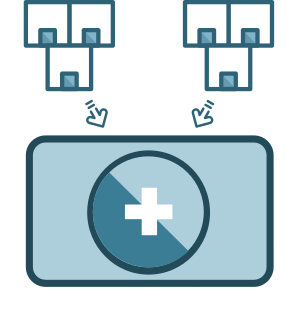
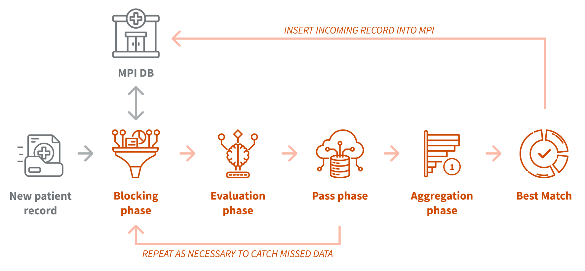

# Record Linker

## Control how patient records are matched and merged

  

Record Linker offers a best-in-class algorithm that allows your
jurisdiction to link incomplete and disparate patient records —
both within and across public health systems — giving you more
complete and accurate patient health profiles.

## What is it?

Record Linker is an open-source tool that uses a configurable,
multi-phase algorithm to efficiently link and deduplicate patient
records across public health systems and jurisdictions. Compared to
existing record linkage tools, our solution offers a high degree of
transparency, customization, and precision, allowing your jurisdiction
to control exactly how patient records are matched and merged.

## How does it work?

With the Record Linker demo, public health staff can look under the
hood to see how our algorithm matches and scores patient records,
highlighting edge cases that show the logic behind each match
decision.

**Record Linker analyzes patient records using a four-phase linkage process:**

1. **Blocking phase**: Uses coarse field-matching parameters to identify "roughly
similar" records from the database. For example, when searching
for candidates to match with Jonathan Smith, Record Linker would
retrieve all records whose first name starts with "Jona" and whose
last name starts with "Smit". This narrows down the set of
potential matches.

2. **Evaluation phase**: Uses fine-grained fuzzy matching to assess how closely
the blocked candidates compare with the incoming records across several
different attributes. Each candidate then receives a Link Score
reflecting its quality as a potential match.

3. **Pass phase**: Performs the blocking and evaluation steps again for each
combination of fields based on a user-specified number of passes.
This lets Record Linker account for missing data and changes over
time (such as a person moving and updating their address).

4. **Aggregation phase**: Collects the Link Scores calculated across all passes
and sorts the results to determine the most likely patient match.

