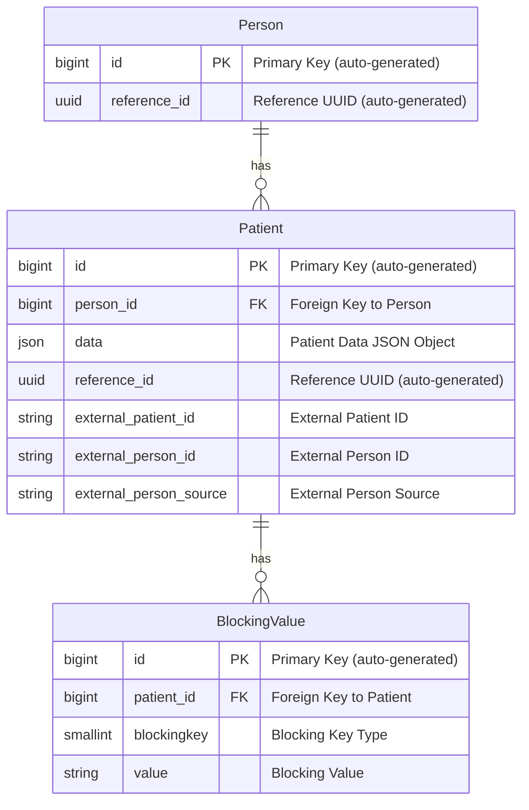

# Schema Design

This document provides an overview of the key database models involved in the Master Patient Index (MPI) system and explains how they interact to facilitate person linking via an algorithm.

## Key Models

### 1. **Person Model**

The `Person` model represents an individual in the MPI system. Each person may have multiple associated `Patient` records, which are unique representations of that person in various external systems.

### 2. **Patient Model**

The `Patient` model represents an external record for a person.  This is a point-in-time representation of an individual sourced in a health care document. Each `Patient` is linked to a single `Person` and contains multiple `BlockingValue` records that aid in matching similar patients.

### 3. **BlockingValue Model**

The `BlockingValue` model stores all the potential key-value pairs used in the record linkage process. These pairs represent simplified or truncated versions of personally identifiable information (PII), such as birthdate, name, or address, which are used in the blocking phase of the algorithm to quickly find potential matches.

---

## Entity Relationship Diagram

The following diagram illustrates the relationships between the `Person`, `Patient`, and `BlockingValue` models:

**Note**: Both the Person and Patient models include an `INT id` and a `UUID reference_id`
column. While either could serve as the primary key, using both provides optimization
benefits at the  cost of additional storage.
The `INT id` column is designated as the primary key due to its smaller size, making it
more efficient for indexing and joining operations. However, using integers as user-facing
keys poses a security risk by potentially revealing the number of records in the database.
To address this, the `UUID reference_id` is used as a reference key, offering a secure way
to reference records without exposing the total record count.
In summary, `INT id` optimizes indexing and joins, while `UUID reference_id` is used
externally for secure record references.

---

## How These Models Work in the Algorithm

The MPI system is designed to link records from different sources that potentially represent the same person. The record linkage algorithm uses **blocking keys** to reduce the number of potential matches to be evaluated. The workflow can be described as follows:

1. **Data Ingestion**:
   When patient data is loaded into the system, the **Patient** record is initialized, and the **BlockingValue** records are generated based on the patient's PII data (e.g., birthdate, name, address).
   
2. **Blocking**:
   The **BlockingKey** enum defines the types of blocking values that are generated from the patient data. For example, the first 4 characters of the patient's first name or their birthdate can serve as a blocking key.
   
   Blocking is used to reduce the search space for potential matches by grouping patients based on these simplified values. RecordLinker blocks on two types of Patient records:
   
   (1) Patient records that share the same blocking values as the incoming record; _and_
   (2) Patient records that are missing data in the fields used for blocking, but which are members of the Person clusters of the Patient records identified in (1) above.

   We use the **BlockingValue** records from the incoming patient to quickly find potential matches against existing patients in the MPI (matching on their blocking values, and including any patient records in the Person clusters of those blocked on).

3. **Record Comparisons and Match Scores**:  
   The system compares the incoming patient record against patient records that share the same blocking values, as well as patient records in the Person clusters of those that share the same blocking values which are missing data in the fields used for blocking (such records aren't blocked on individually because of this missingness, so including them after the fact allows them to be considered).

   For each Person cluster found during blocking, the system computes an aggregated **log-odds sum** measuring the median number of **log-odds points** the incoming record scored in comparison to each Patient record in the cluster. These sums are tracked across the algorithm and are used to compute a **Relative Match Score**, the percentage of total possible log-odds points the incoming record scored during evaluation. These **RMS** values are used in conjunction with **minimum match** and **certain match** thresholds supplied by the user to make final linkage decisions.

4. **Person Linking**:
   For each Person cluster found, a **match-grade** is assigned based on where that cluster's **RMS** falls in relation to the provided thresholds:

   - If **RMS** < **minimum match threshold**, the cluster is graded as **certainly-not** a match.
   - If **RMS** >= **certain match threshold**, the cluster is graded as a **certain** match.
   - Otherwise, if the **RMS** is between the two thresholds, the cluster is graded as a **possible** match.

   If at least one cluster is graded as **certain**, the **certain** cluster with the highest **RMS** is returned as the result, and a link is formed between that cluster and the incoming record. Otherwise, if at least one cluster graded as **possible**, no links are made automatically, but the **possible** cluster is returned to the user for manual evaluation.

---

## Key Relationships

- **Person-Patient Relationship**:  
  A **`Person`** can have multiple **`Patient`** records linked to it. This one-to-many relationship allows the system to handle multiple external representations of the same person across different systems.

- **Patient-BlockingValue Relationship**:  
  Each **`Patient`** has multiple **`BlockingValue`** records. These represent simplified versions of PII, used to efficiently group similar patients during the matching process.

---

## Conclusion

This system of models—**Person**, **Patient**, and **BlockingValue**—works together to enable scalable and efficient patient matching in the Master Patient Index. The use of **blocking values** reduces the computational complexity of the matching process while maintaining the flexibility to support different algorithms.  There is some duplication of data in the MPI, as each Patient record contains all the PII data in the `data` field, some of which is duplicated in the **BlockingValues** table.  However, the duplication is necessary to support an efficient and flexible matching process.
