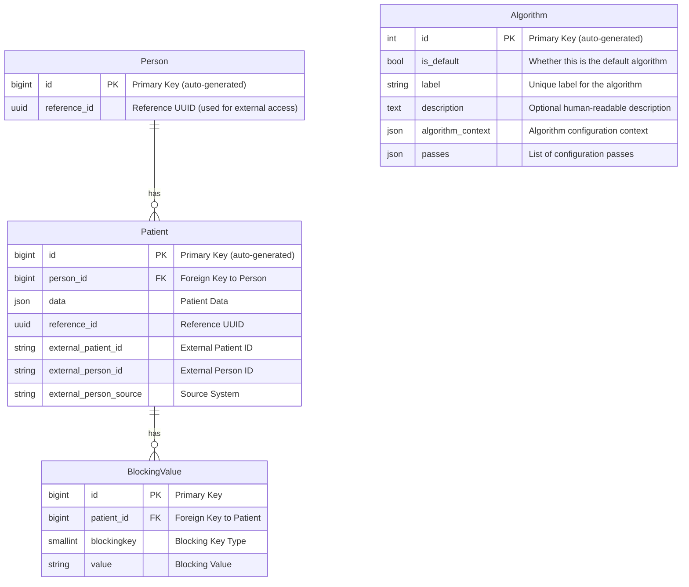

# Schema Design

This document outlines the database schema supporting the **Master Patient Index (MPI)** system. It describes the primary data models used to perform record linking via the configurable algorithm.

---

## Overview of Key Models

### 1. **Person**

The `Person` model represents a unique individual within the MPI system. It serves solely as an identifier, linking a cluster of patient records without asserting any canonical characteristics of the individual.

### 2. **Patient**

The `Patient` model represents how an external system defines a person within a specific healthcare record. Each `Patient`:

- Is stored as a JSON object, used during the evaluation phase of matching
- Is linked to multiple `BlockingValue` records, utilized in the blocking phase of matching
- May optionally be associated with a single `Person`

### 3. **BlockingValue**

The `BlockingValue` model stores normalized — and sometimes partial — representations of patient attributes (e.g., name prefixes, birthdates), which are used during the **blocking phase** to efficiently limit the number of record comparisons. All data elements in this table are duplicated from the `Patient` model to enable fast, approximate matching without scanning entire JSON blobs. This design intentionally trades increased storage usage for improved query performance.

### 4. **Algorithm**

The `Algorithm` model stores **user-defined configuration** for running the record linkage algorithm. This table is **not part of the entity matching graph**, but provides control over how matches are calculated and thresholds applied.

---

## Entity Relationship Diagram

> **Design Note**: Both the `Person` and `Patient` models include two identifiers: an `INT id` and a `UUID reference_id`. While either could serve as the primary key, using both offers performance and security benefits at the cost of some additional storage. The `INT id` is designated as the primary key because of its compact size, which makes it more efficient for indexing and join operations. However, exposing sequential integer IDs externally can pose a security risk by making it easier to infer the number of records in the database. To mitigate this, the `UUID reference_id` serves as a secure, external-facing identifier. It enables safe referencing of records without revealing internal record counts or sequences. In short, the `INT id` is optimized for internal performance, while the `UUID reference_id` provides a secure external reference.

### 🔗 Key Relationships Summary

| Relationship                | Description |
|-----------------------------|-------------|
| **Person → Patient**        | A person may be linked to many external `Patient` records |
| **Patient → BlockingValue** | A patient may have many `BlockingValue` entries for blocking comparisons |
| **Algorithm (config)**      | Stores match settings and thresholds used during processing; not joined in match graphs |
